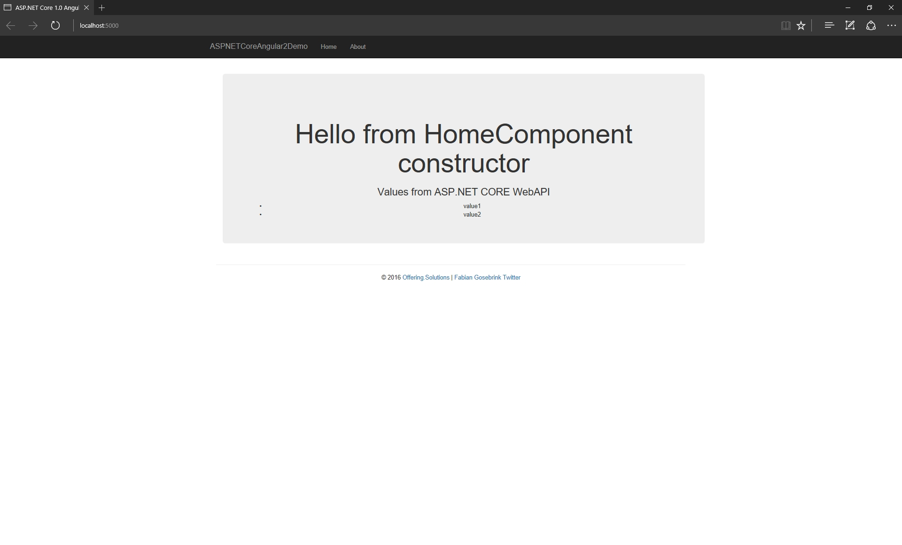
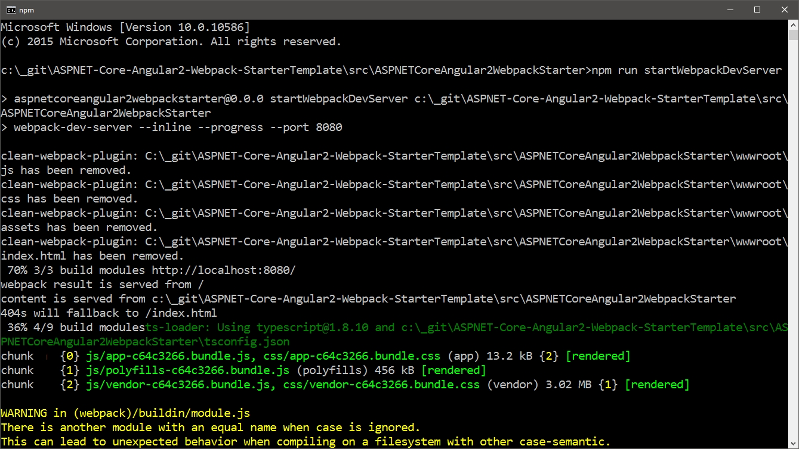
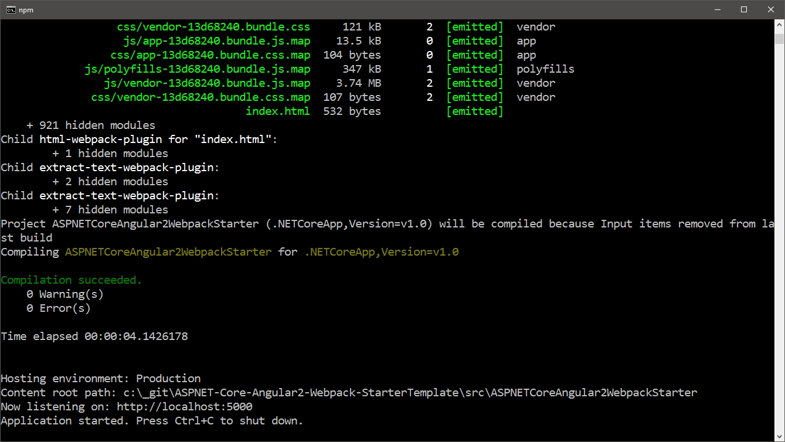

# Angular 2 // Webpack // ASP.NET CORE 1.0 Starter Template

This is a starter template for developing Angular2 with ASP.NET Core 1.0 Applications using webpack for bundling.

This template is an Angular2 application with an http-service getting values from an ASP.NET CORE WebAPI.

## Blogpost

[How to set up Angular 2 and Webpack in Visual Studio with ASP.NET Core](http://offering.solutions/articles/asp-net/how-to-set-up-angular-2-and-webpack-in-visual-studio-with-asp-net-core/)

## Start

Start by typing

`npm install`

at the level of the "package.json" file

### Option 1 (Frontend and backend running)

Now you can just press "play" inside Visual Studio to get started.

If you change the *.ts-files you need to run the `tsc` command manually.

### Option 2 (Only frontend is running)

`npm run startWebpackDevServer` will run the webpack dev server. After this you can browse to 

`localhost:8080`

and see the page working. You can do changes to the application and they will be automatically reflected in the browser.

### Option 3 (frontend and backend running)

You can type `npm run build` and browse to `localhost:5000` to see the page. This will trigger an webpack build and an `dotnet run`.

